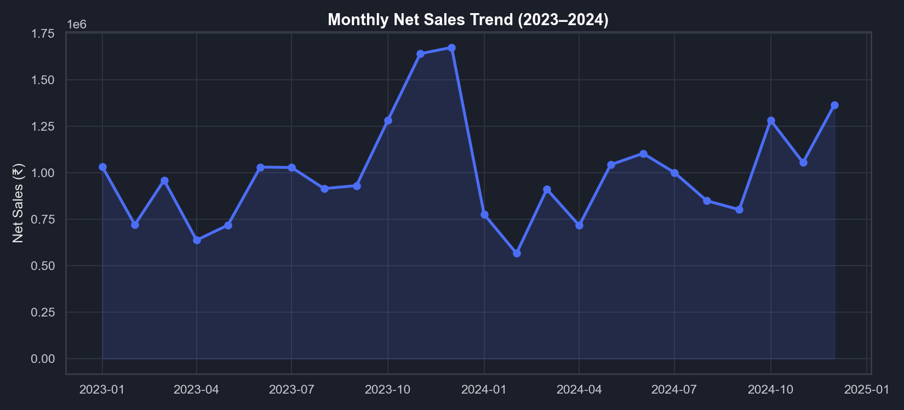
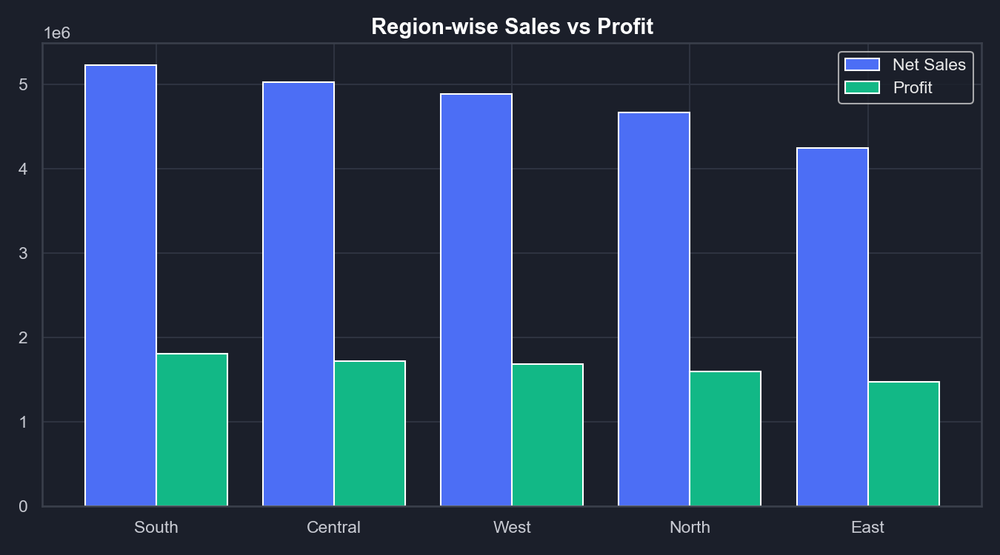
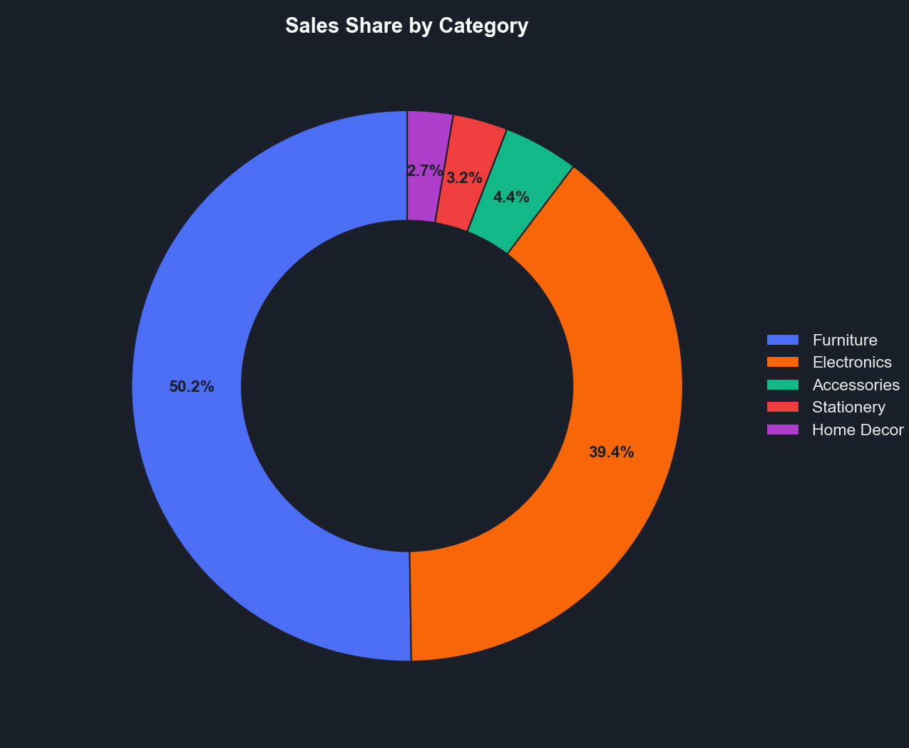
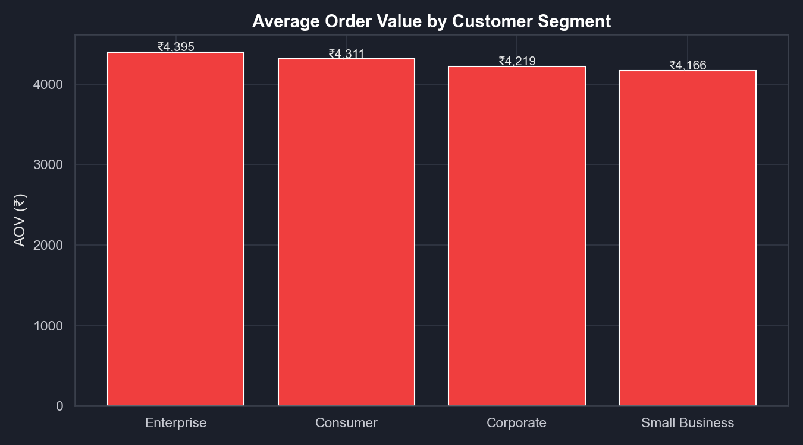
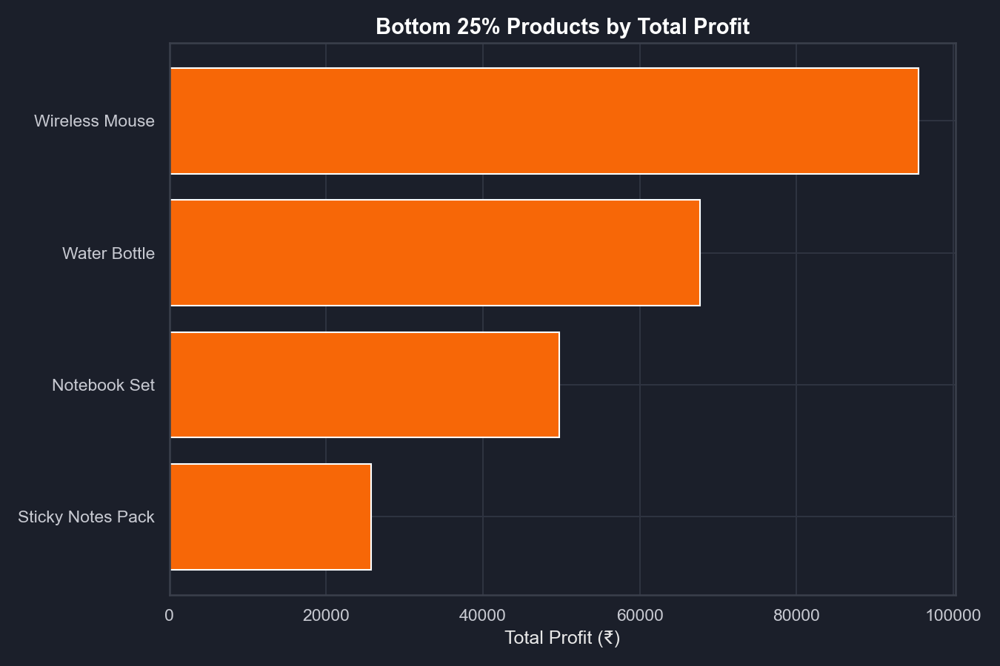

# 📊 Sales Insights Dashboard — Data Analytics Project

An end-to-end sales analytics project built on a simulated retail dataset (2023–2024).
The goal was to take raw transactional data all the way to business-ready insights —
cleaning and modeling it in SQL, analyzing it in Python, and designing an interactive
Power BI dashboard that tracks the KPIs a sales/ops team actually cares about.

**Tech used:** SQL (MySQL) • Power BI • Python (Pandas, Matplotlib, Seaborn) • DAX • Excel

---

## Why this project

Most "dashboard" tutorials stop at pretty charts. I wanted to practice the full workflow
I'd actually use on the job: pull messy transactional data out of a database, clean it
properly, write SQL that answers real business questions, and only then build the
dashboard on top of a model that's already trustworthy — instead of dragging raw columns
into Power BI and hoping for the best.

## The dataset

`data/sales_data.csv` — ~5,600 order-line records simulating two years of sales for a
retail company across 5 regions, 4 customer segments, 5 product categories and 16 products.
It's generated (see `python/generate_data.py`) with realistic seasonality (festive-season
spike in Oct–Dec, a February dip, weekend order bumps), random discounts, and a handful of
intentional data-quality issues (duplicate rows, missing discount values) so the cleaning
step in this project is doing real work and not just for show.

| Column | Description |
|---|---|
| OrderID, OrderDate | Unique order line, transaction date |
| CustomerID, CustomerSegment, Region | Who bought it, and from where |
| ProductName, Category, UnitPrice, Quantity | What was bought |
| DiscountPct, GrossAmount, NetSales, Cost, Profit | Pricing & profitability |

## Project structure

```
sales-insights-dashboard/
├── data/
│   └── sales_data.csv
├── sql/
│   ├── 01_schema.sql
│   ├── 02_data_cleaning.sql
│   └── 03_analysis_queries.sql
├── python/
│   ├── generate_data.py
│   └── eda_and_charts.py
├── powerbi_notes/
│   └── PowerBI_Build_Guide.md
├── images/
│   └── (dashboard chart exports)
└── README.md
```

## 1. Data cleaning (SQL)

Raw data gets loaded into `sales_raw`, then cleaned into `sales_clean`
(`sql/02_data_cleaning.sql`):
- de-duplicated exact repeat orders (same customer, date, product, quantity, amount)
- missing `DiscountPct` values filled with 0
- invalid rows (zero/negative sales or quantity) dropped
- derived columns added: `OrderYear`, `OrderMonth`, `ProfitMarginPct`

## 2. Business questions answered in SQL (`sql/03_analysis_queries.sql`)

Uses joins, CTEs, and window functions (`LAG`, `RANK`, `NTILE`) to answer:
- What are the headline KPIs — total sales, profit, orders, AOV, margin %?
- What's the month-over-month growth trend?
- Which region is performing best, and by how much?
- How does average order value differ by customer segment?
- **Which products fall in the bottom 25% by profit?** (the "low-performing products" ask)
- Who are the top 10 customers by lifetime value?
- Which categories grew or shrank year-over-year?

## 3. Power BI Dashboard

Built on the `sales_clean` model with DAX measures for Sales, Profit, AOV, Growth %,
and YTD — full build steps and DAX in [`powerbi_notes/PowerBI_Build_Guide.md`](powerbi_notes/PowerBI_Build_Guide.md).
Three pages: **Overview** (KPI cards + trend), **Product Performance** (bottom-25%
profit view with drill-through), **Customer Insights** (segment + top customers).

The chart exports below (`python/eda_and_charts.py`) mirror exactly what the Power BI
pages show, so the dashboard is visible right here even without opening Power BI:

### Monthly Sales Trend


### Region-wise Sales vs Profit


### Sales Share by Category


### Average Order Value by Customer Segment


### Bottom 25% Products by Profit


## Key insights

- **Furniture (50%) and Electronics (39%) drive ~90% of revenue**, but Electronics has
  the thinnest margin of all categories (~30% vs ~36% for Furniture and 43–53% for the
  smaller categories) — the biggest revenue driver is not the most profitable one.
- **Q4 is the peak season:** October–December sales run roughly 28–52% above the monthly
  average (December is the highest), while February is the weakest month at about 36%
  below average — inventory and staffing should be planned around this.
- **South is the top region and East the lowest** — South sells ~23% more than East
  (₹5.22M vs ₹4.25M) — worth digging into why East lags (pricing? fewer active customers?).
- **4 of 16 products — Sticky Notes Pack, Notebook Set, Water Bottle, Wireless Mouse — sit
  in the bottom 25% by profit contribution.** These are low-ticket items; candidates for
  a price adjustment, bundling, or being phased out.
- **Average order value is almost flat across segments** (₹4,166–₹4,395), so growth has
  to come from order volume, not from pushing one segment to bigger baskets. Consumers
  generate ~49% of sales simply because they are the largest customer group.

## How to run this yourself

```bash
# 1. Clone the repo
git clone https://github.com/mayankmishra-dev/sales-insights-dashboard.git
cd sales-insights-dashboard

# 2. Install Python dependencies
pip install -r requirements.txt

# 3. (Optional) regenerate the dataset
python python/generate_data.py

# 4. Run the cleaning + EDA + chart generation
python python/eda_and_charts.py

# 5. SQL: load data/sales_data.csv into MySQL, then run in order
#    sql/01_schema.sql -> sql/02_data_cleaning.sql -> sql/03_analysis_queries.sql
```

## Author

**Mayank Kumar Mishra**
Final-year B.Tech CSE @ SRCEM, Lucknow
[LinkedIn](https://linkedin.com/in/mayank-kumar-mishra-214a9b295) • [GitHub](https://github.com/mayankmishra-dev) • mayankmishraayd@gmail.com
